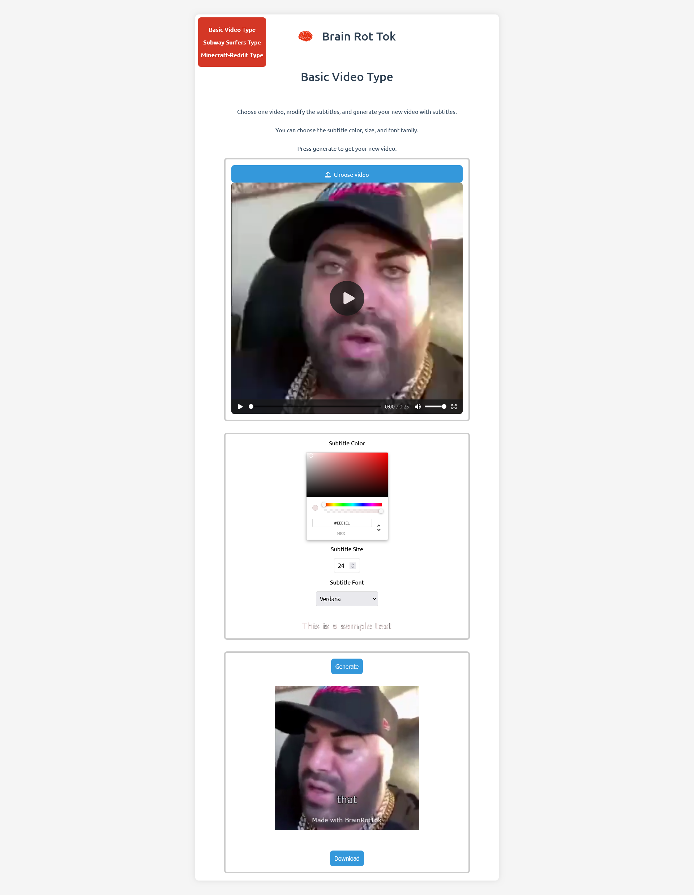
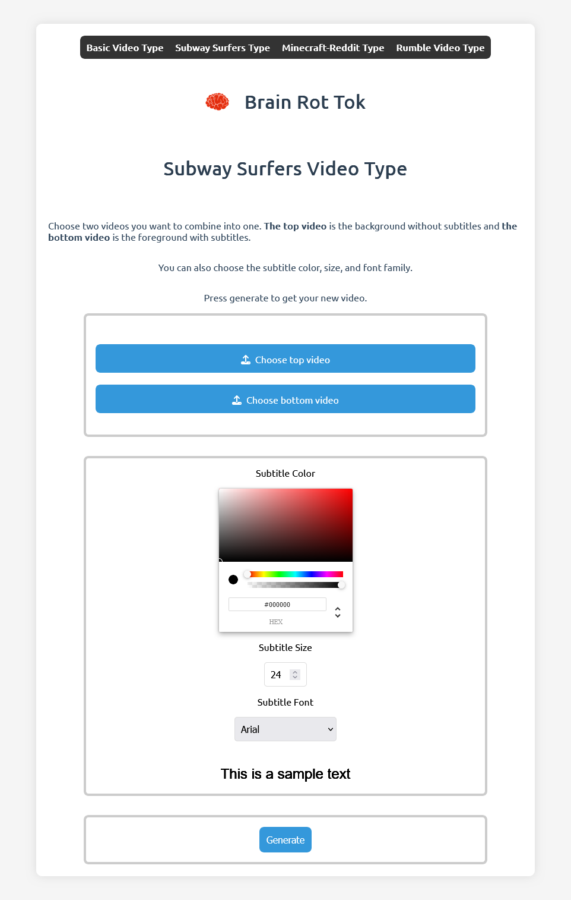
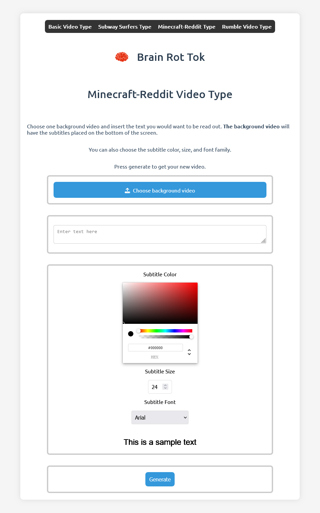
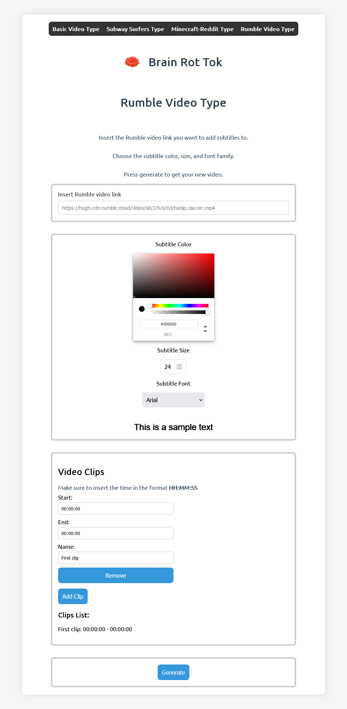

# BrainRotTok

## What is BrainRotTok?

BrainRotTok allows you to create those iconic TikTok videos with subtitles. There are different types of videos you can create, you can find the list of them below in the "What can you do with this?" section.

## What is brain rot?

Brain rot is a term used to describe the feeling of your brain rotting away after watching those highly addictive, short videos on TikTok. It is also used to describe the content that causes this feeling. Brain rot content is usually low effort, low quality, and highly addictive.

[Urban Dictionary](https://www.urbandictionary.com/define.php?term=Brainrot%20Content)

## Why did I make this?

I kept seeing these videos on TikTok and I thought it would be fun to make a website that allows you to create these videos. I also wanted to use FFmpeg and OpenAI's Whisper API, so I thought this would be a good project to do that.

## What can you do with this?

- **Basic**: a video with subtitles underneath
- **Subway Surfers**: a top and bottom video with subtitles for the bottom video and the top video is muted
- **Minecraft Reddit**: a background video with subtitles (provided by you) in the middle and the subtitles are spoken by a text-to-speech voice
- **Rumble Video**: a Rumble video link is provided and you can choose between different clips from the video. The subtitles are automatically generated and a zip folder is returned with the video and the subtitles.

## What technologies are used?

- React (with TypeScript)
- Python
- FastAPI
- Whisper (OpenAI)
- FFmpeg
- ImageMagick

## How to run this?

### All in one

Execute the following command:

Make sure the PowerShell script execution policy is set to `RemoteSigned` or `Unrestricted` (you can do this by running `Set-ExecutionPolicy RemoteSigned` or `Set-ExecutionPolicy Unrestricted` in PowerShell as an administrator).

```bash
.\run.ps1
```

This will run the server and client at the same time while opening up two terminals, so you can see the output of both the server and client.

You can also individually run the server and client in the next two sections.

### Server

Execute the following commands:

```bash
cd ./brain-rot-tok-server
pipenv install
pipenv shell
python server.py
```

### Client

Execute the following commands:

```bash
cd ./brain-rot-tok-client
npm install
npm run dev
```

Then just open the link that is printed in the console. This should be `http://127.0.0.1:5173/`

After the server is running, you can go to the client and start using the website.

## Examples









## Example video

**Basic Example**

https://github.com/Detopall/BrainRotTok/assets/90131569/74f67256-9bc4-43ed-81a2-1d37dd1f5411

**Subway Surfers Example**

https://github.com/Detopall/BrainRotTok/assets/90131569/4239972d-19d8-444d-af16-8b81e8c76c03

**Minecraft Reddit Example**

https://github.com/Detopall/BrainRotTok/assets/90131569/d84bbdfe-868d-4b7d-b5c7-c4a42c14d8da

**Rumble Video Example**

https://github.com/Detopall/BrainRotTok/assets/90131569/32b60a46-5ef5-48d8-ba61-eed8751b0854
