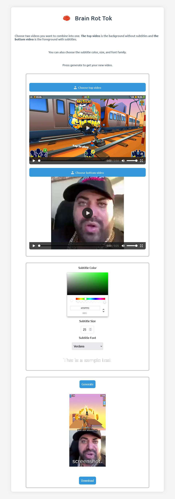

# BrainRotTok

## What is BrainRotTok?

BrainRotTok allows you to create those iconic TikTok videos where one half of the screen is a random subway surfers video and the other half is another random video with subtitles.

## What is brain rot?

Brain rot is a term used to describe the feeling of your brain rotting away after watching those highly addictive, short videos on TikTok. It is also used to describe the content that causes this feeling. Brain rot content is usually low effort, low quality, and highly addictive.

[Urban Dictionary](https://www.urbandictionary.com/define.php?term=Brainrot%20Content)

## Why did I make this?

I kept seeing these videos on TikTok and I thought it would be fun to make a website that allows you to create these videos. I also wanted to use FFmpeg and OpenAI's Whisper API, so I thought this would be a good project to do that.

## What can you do with this?

You can upload you own videos and the application will automatically generate the subtitles for you. You can customize the subtitles (color, font, size, etc.) and the position of the video. You can also choose to upload your own subtitles.

## What technologies are used?

- React (with TypeScript)
- Python
- FastAPI
- Whisper (OpenAI)
- FFmpeg
- ImageMagick

## How to run this?

### Client

Execute the following commands:

```bash
cd ./brain-rot-tok-client
npm install
npm run dev
```

### Server

Execute the following commands:

```bash
cd ./brain-rot-tok-server
pipenv install
pipenv shell
python server.py
```

## Example



## Example video

You can't hear the audio because that isn't possible in markdown, but you can find the video in the readme-assets folder

<video width="640" height="480" controls>
  <source src="./readme-assets/example-video.mp4" type="video/mp4">
</video>
